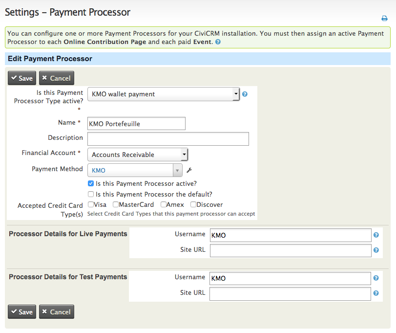

# CiviCRM KMO Wallet payments.

Adds payment option: KMO wallet<br>
- [Installation](#installation)
- [Configuration](#configuration)

## Installation

- Enabling the extension which can be done from<br> 
```"Administer -> System Settings -> Manage CiviCRM Extensions".```

## Configuration

* Visit **Administer > System Settings > Payment Processors**
* Select the appropriate **Payment Processor Type**

